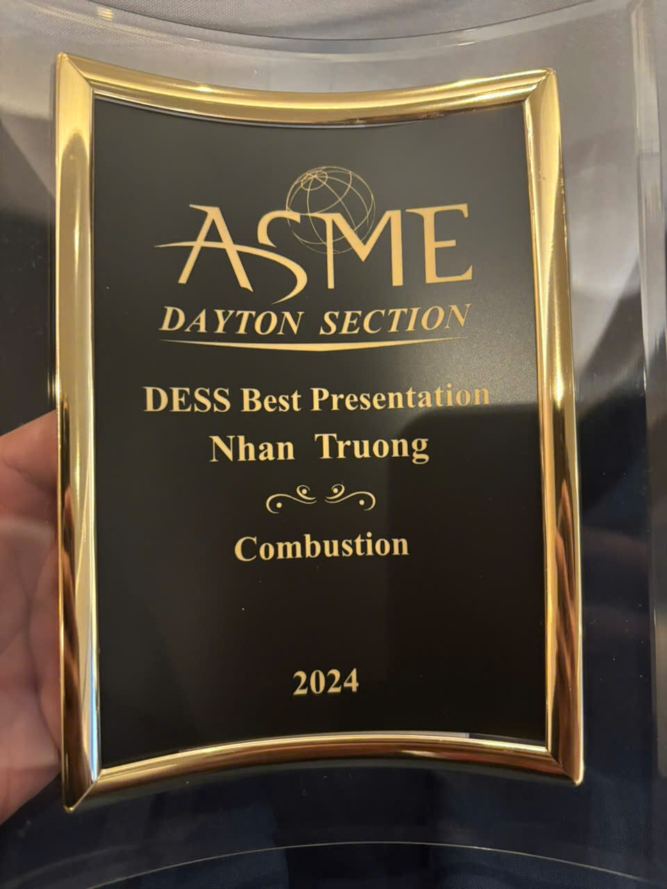
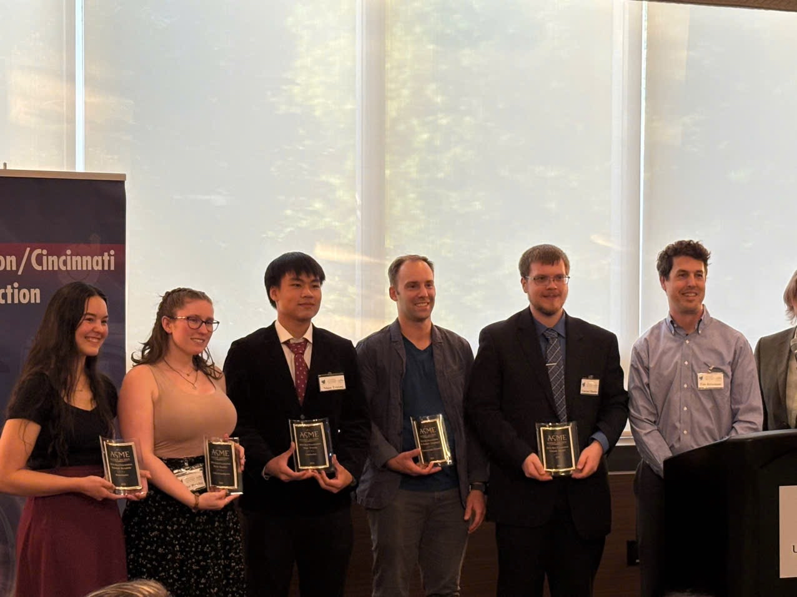

## Authors

Nhan Truong, Jacob Gamertsfelder, Prashant Khare

Department of Aerospace Engineering, University of Cincinnati, Cincinnati, OH, 45221-0070

Hypersonics Laboratory, Digital Futures, University of Cincinnati, Cincinnati, OH, 45206

## Award

This work received the **DESS Best Presentation Award in Combustion** at the ASME Dayton Section's 16th Dayton Engineering Sciences Symposium, October 29, 2024.

