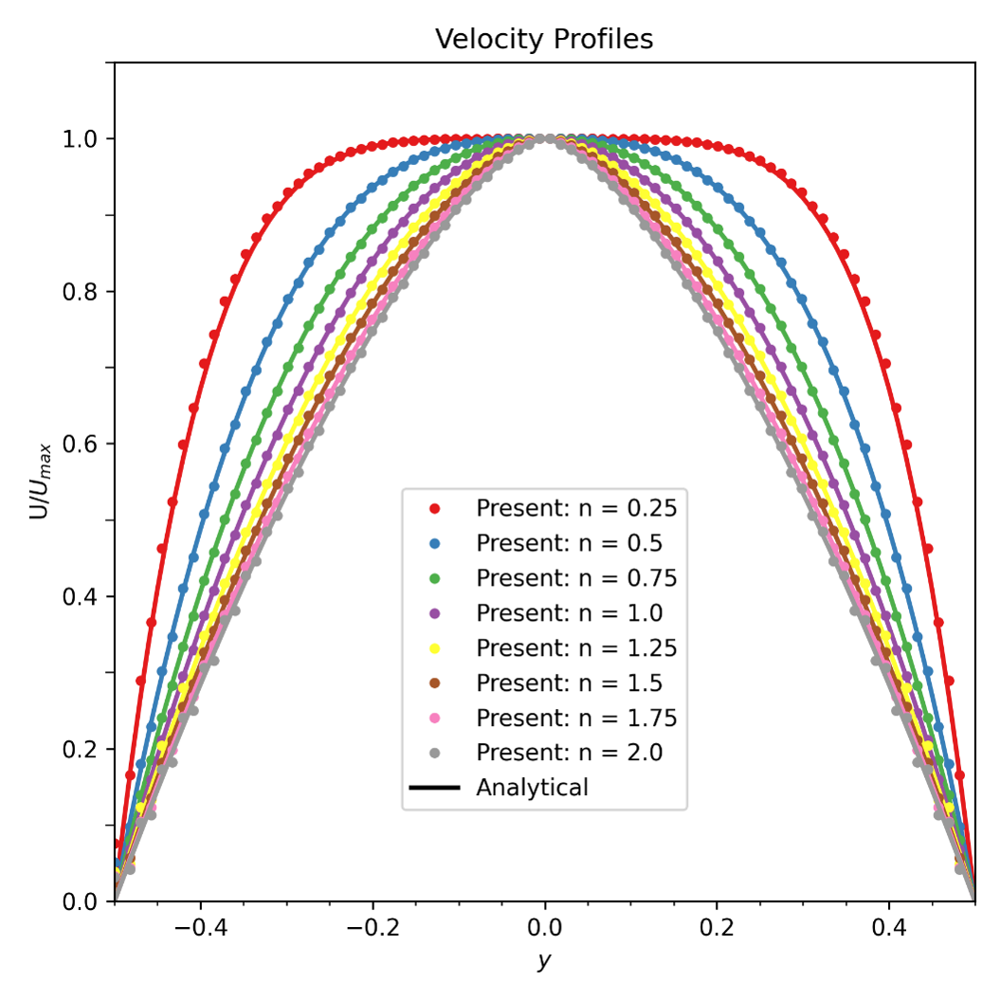
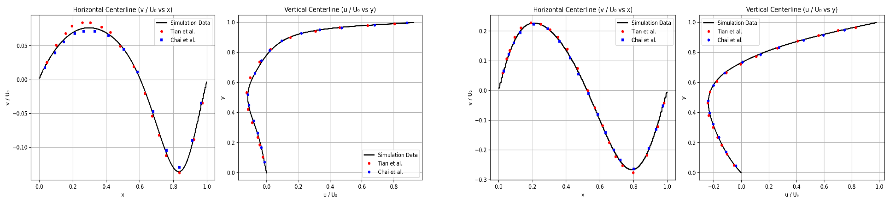
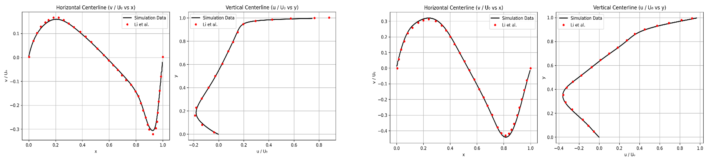
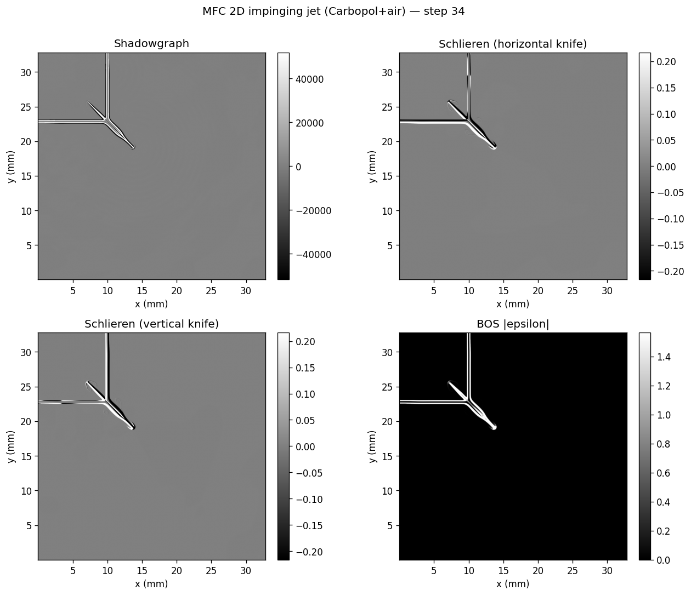

*Co-authors: Nhan Truong, Prashant Khare.*
*Status: ongoing.*

Gel propellants sit between solids and liquids. They store safely and don't ignite by accident, yet you can still throttle them and restart them, which makes them attractive for tactical missiles and upper-stage propulsion. They are also stubborn to spray. A gel only flows once enough stress is applied, so its breakup is far less predictable than an ordinary liquid. I'm simulating how two impinging gel jets form a sheet and break it into droplets.

The work built up in stages.

I started with two classical validation cases for the non-Newtonian solver. Poiseuille flow checks the analytical power-law profile across flow indices from 0.25 to 2.0. Lid-driven cavity reproduces the primary-vortex location from three published datasets at Reynolds numbers of 100 and 500.

  

*Poiseuille flow profile across flow indices from 0.25 to 2.0*

  

  

Lid-driven cavity flow at Re = 100 (top) and Re = 500 (bottom) with n = 0.5 (left) and n = 1.5 (right). The solver matches the analytical and reference results across the range I tested.*

With the rheology checked out, I moved to single-jet injection in Newtonian fluids to stress-test the Direct Forcing Method (DFM) inside the volume-of-fluid (VOF) framework. The DFM has to hold up across very different density ratios, so I compared water injected into air with ethanol injected into nitrogen. The two pairs differ by orders of magnitude in density contrast.

  <video autoplay loop muted playsinline controls src="water_air.mp4" style="flex:1; min-width:300px; max-width:100%;"></video>
  <video autoplay loop muted playsinline controls src="ethanol_nitrogen.mp4" style="flex:1; min-width:300px; max-width:100%;"></video>

*Single-jet injection of water into air (left) and ethanol into nitrogen (right). The DFM-in-VOF framework holds the interface across both density ratios.*

I then swapped the Newtonian liquid for Carbopol gel and ran the same single-jet case. The Herschel-Bulkley model captures the yield-stress behavior, and the jet keeps its column much longer than the Newtonian baseline does at the same conditions.

  <video autoplay loop muted playsinline controls src="carbopol_air.mp4" style="width:100%;"></video>

*Single-jet injection of Carbopol gel into air. The yield stress keeps the jet intact much longer than the Newtonian case.*

Moving from single jets to impinging jets meant rethinking the boundary conditions. The Dirichlet inlet in this solver only allows the velocity component normal to the inlet face, so the standard angled-inlet setup doesn't apply directly. I built up the 2D impinging case in Newtonian water-air first, sweeping impingement angles to make sure the workaround held.

  <video autoplay loop muted playsinline controls src="impinging_water_air_25.mp4" style="flex:1; min-width:300px; max-width:100%;"></video>
  <video autoplay loop muted playsinline controls src="impinging_water_air_50.mp4" style="flex:1; min-width:300px; max-width:100%;"></video>

*Impinging-jet sheet formation in water-air at 25 cells (left) and 50 cells (right) per nozzle diameter.*

The current focus case is the same 2D impinging configuration with Carbopol gel. The sheet forms more slowly than in water and breaks into thicker ligaments before pinching off, which matches what the experimental literature suggests but rarely shows directly.

  <video autoplay loop muted playsinline controls src="impinging_carbolpol_air.mp4" style="width:100%;"></video>

*Carbopol gel impinging in 2D. The yield stress thickens the sheet and slows the breakup.*

To compare the impinging-jets results with experiment, I need synthetic visualizations that match what a high-speed camera would actually see. I wrote a Python ray-trace solver that produces those images directly from the CFD output. The current version implements line-of-sight integration of the refractive-index field. It does not yet include eikonal ray bending, Snell refraction with Fresnel coefficients at interfaces, or the full optical chain that Kalita et al. (2026) use.

Running it on the 2D Carbopol impinging-jets data produces four visualizations from the same density field. These are a standard shadowgraph, Schlieren with a horizontal knife, Schlieren with a vertical knife, and Background-Oriented Schlieren (BOS).

  

*Synthetic shadowgraph (top-left), Schlieren with horizontal knife (top-right), Schlieren with vertical knife (bottom-left), and Background-Oriented Schlieren (bottom-right), computed from the same MFC density field at step 34.*

Varying the display clip level reveals different feature classes from the same simulation. A 99th-percentile clip gives a clean shadowgraph of the liquid jets and the impingement sheet. Dropping to the 90th or 80th percentile saturates the strong air-liquid interface and brings out finer gas-phase structure. Vortex shedding and entrained-air gradients around the jets become visible, and even concentric acoustic waves radiating outward from the impingement region show up.

  <video autoplay loop muted playsinline controls src="sg_clip80.mp4" style="flex:1; min-width:280px; max-width:100%;"></video>
  <video autoplay loop muted playsinline controls src="sg_clip90.mp4" style="flex:1; min-width:280px; max-width:100%;"></video>
  <video autoplay loop muted playsinline controls src="sg_clip99.mp4" style="flex:1; min-width:280px; max-width:100%;"></video>

*Synthetic shadowgraph of the 2D Carbopol impinging-jets case at three clip levels. From left to right, the 80th, 90th, and 99th percentile. Stronger clipping saturates the liquid interface and exposes the gas-phase structure around the jets.*

Two things are still open. The yield-stress term blows up at near-zero shear rate, so the model needs careful handling right where the gel is barely moving. The jump from 2D to a fully 3D spray is the next real hurdle, and the angled-jet inlet will need a different boundary-condition workaround in 3D.
