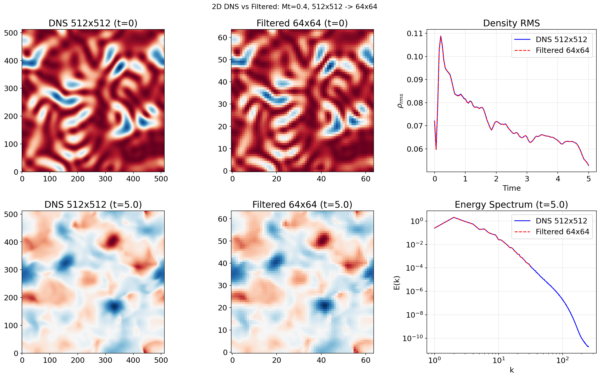
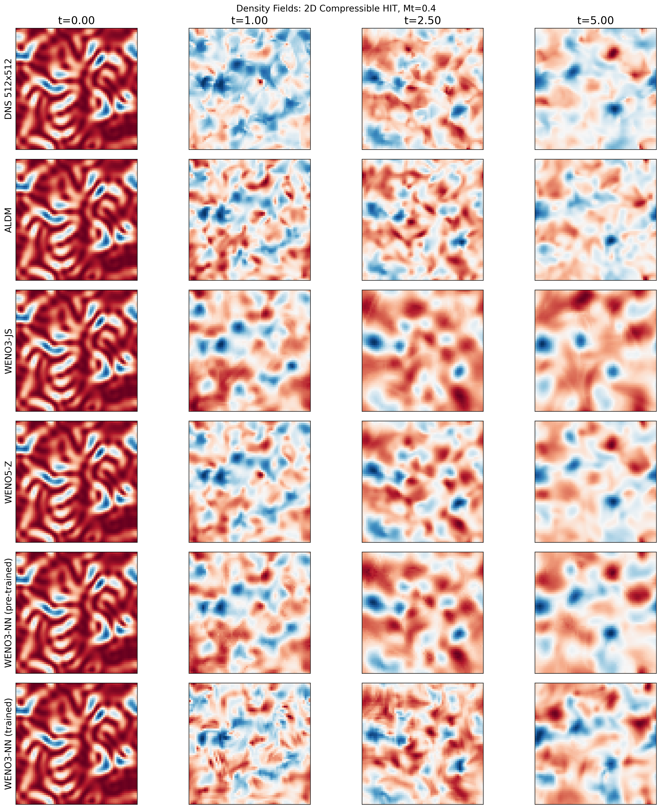
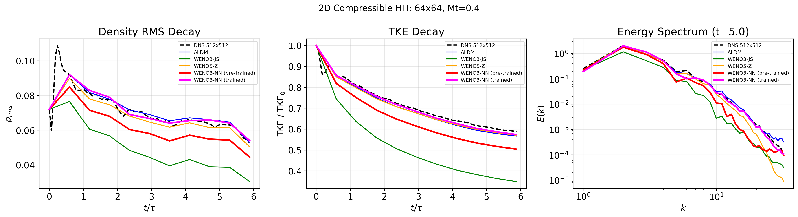
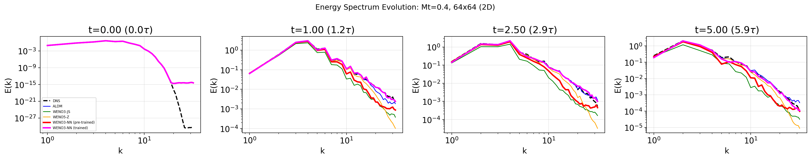
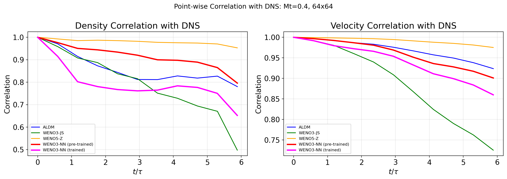

*Co-authors: Nhan Truong, Prashant Khare.*
*Status: ongoing.*

### Motivation

High-fidelity turbulence simulations are accurate but slow. A single case can run for weeks. Recent work by Kochkov et al. (2021) and List et al. (2022) showed that training a neural network inside the solver (the "solver-in-the-loop" approach) can cut that by one to two orders of magnitude. I'm carrying the idea into compressible turbulence, the regime that matters for high-speed propulsion. The goal is a coarse-grid run that holds the accuracy of a much finer grid at a fraction of the cost.

### Where the network lives

A finite-volume step does three things. It reconstructs the flow state at each cell interface, hands those states to a Riemann solver for the numerical flux, then advances in time. I learn only the reconstruction step (the WENO part) and leave the rest fixed.

That choice is deliberate. The reconstruction is where most of the coarse-grid error comes from, because the nonlinear WENO weights are hand-tuned heuristics that over-dissipate on an under-resolved grid. Keeping the Riemann solver and the flux differencing untouched means the scheme stays conservative and upwind-stable by construction. The network nudges the interface states but cannot break the underlying physics. Learning the flux directly would throw that guarantee away and risk blowing up at shocks.

  

*The network sits in the reconstruction box of the finite-volume update loop. The whole solver is differentiable, so training gradients flow back through the Riemann solver and the time-stepping itself. The scheme is optimized on how it performs over many steps, not on a single reconstruction in isolation.*

### Building the training data

The targets come from a high-resolution DNS, filtered down to the coarse grid to give the cell averages a faithful scheme should reproduce. The learned reconstruction is then trained to keep the coarse run close to that filtered reference as the solution rolls forward in time.

  

*A fine-grid DNS snapshot (left) and the same field filtered onto the coarse grid (right). The right panel is the coarse target the scheme is trained against.*

### Training the scheme

> **\[PLACEHOLDER\]** Training-loss curve over epochs (left), and accuracy versus rollout length (right). How long the learned scheme stays faithful as the solver is unrolled for more steps.

### Evaluation

I benchmarked the learned WENO3 against the standard WENO3-JS and WENO5-Z schemes and against ALDM, with a 512×512 DNS as the reference. On decaying 2D compressible homogeneous isotropic turbulence (64×64, turbulent Mach number 0.4), the trained scheme follows the DNS density-RMS decay, kinetic-energy decay and energy spectrum more closely than the third-order baseline does at the same resolution.

Qualitatively, the density field from the learned scheme stays closer to the filtered DNS than any of the baselines.

  

*Density fields at successive timesteps for the DNS reference and the four schemes at 64×64. The learned WENO3 tracks the DNS most closely.*

  

  

*Density-RMS and kinetic-energy decay (top), and the energy spectrum compared against DNS (bottom). The learned scheme stays closer to DNS than WENO3-JS, WENO5-Z and ALDM.*

  

*Pointwise field correlation between the coarse-grid solution and the filtered DNS over time. The learned WENO3 maintains correlation longer than the baseline schemes.*

The open question is generalization. Does a scheme trained at one Mach number and grid resolution stay accurate (and stable) on conditions it never saw, especially once the test case moves into 3D?
