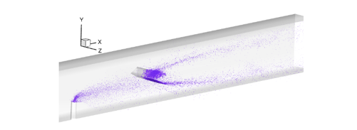
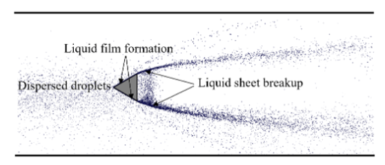
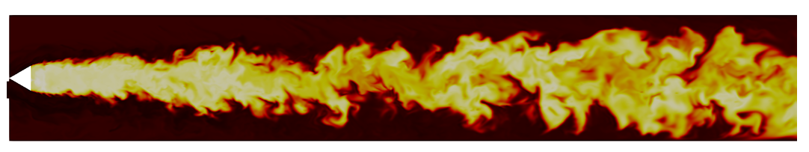
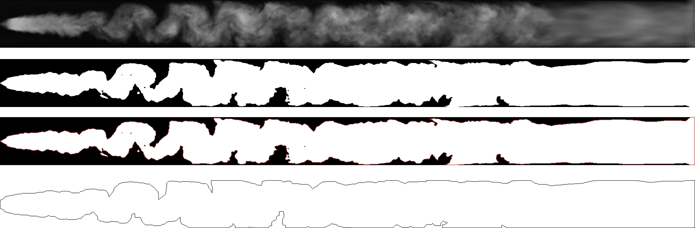
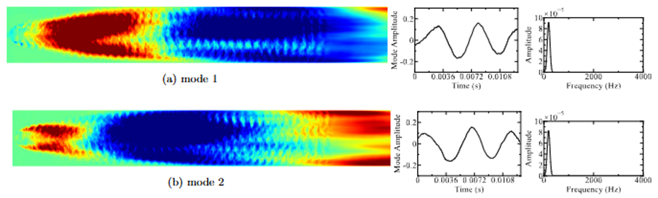

*Co-authors: Kamin Manu, Nhan Truong, Prashant Khare.*
*Status: completed.*

A ramjet has to atomize, vaporize, mix and ignite liquid fuel within a few milliseconds while the air rushes past at a hundred meters a second. A V-gutter anchors the flame so it doesn't blow out, but the high temperature, dense spray and shocks make the anchoring region almost impossible to measure directly, which is where LES earns its keep.

  

*The LES domain. Liquid kerosene is injected into a 600 K air stream at 100 m/s, and a V-gutter mid-channel anchors the flame in its wake.*

The first surprise was the spray behavior near the holder. The droplets don't splash off the gutter as you'd expect. They form a thin film that runs along the surface and vaporizes near the hot walls, putting a near-stoichiometric mixture right where the flame sits.

  

*Liquid film formation on the V-gutter surface. The droplets accumulate into a film that tracks along the holder and vaporizes at the trailing edge.*

The flame itself wraps both shear layers shed off the gutter and oscillates with the vortex shedding and the chamber's longitudinal acoustic modes. The grayscale rendering of the temperature gradient makes the flame edge easy to follow.

  

*Instantaneous flame in the V-gutter wake. The reaction zone wraps both shear layers shed off the gutter.*

  <video autoplay loop muted playsinline controls src="flame.mp4" style="width:100%;"></video>

*Unsteady flame motion behind the V-gutter, rendered as a grayscale temperature gradient.*

To quantify the oscillation, I built an OpenCV pipeline that pulls the flame boundary out of the temperature field frame by frame and gives the mean width and RMS fluctuations.

  

*Stages of the flame-boundary extraction pipeline. The output gives a per-frame flame position from which the mean width and RMS fluctuations are computed.*

A POD on the temperature field then pulls out the dominant unsteady modes. The leading ones pick up the vortex-shedding signature off the gutter, with the longitudinal acoustic motion of the chamber showing up further down the rank.

  

*Leading POD modes of the temperature field.*

How tightly the film-vaporization route couples to the flame's instability modes is something the post-processing hints at but doesn't pin down. A thread worth pulling on with a reacting simulation built to ask that question directly.
