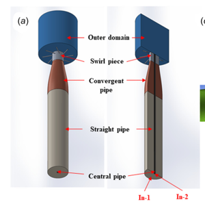
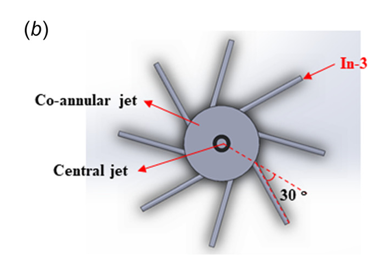
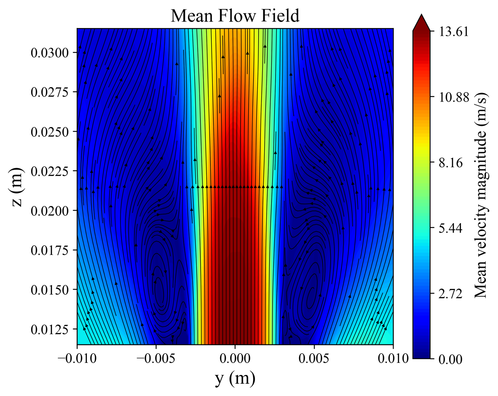
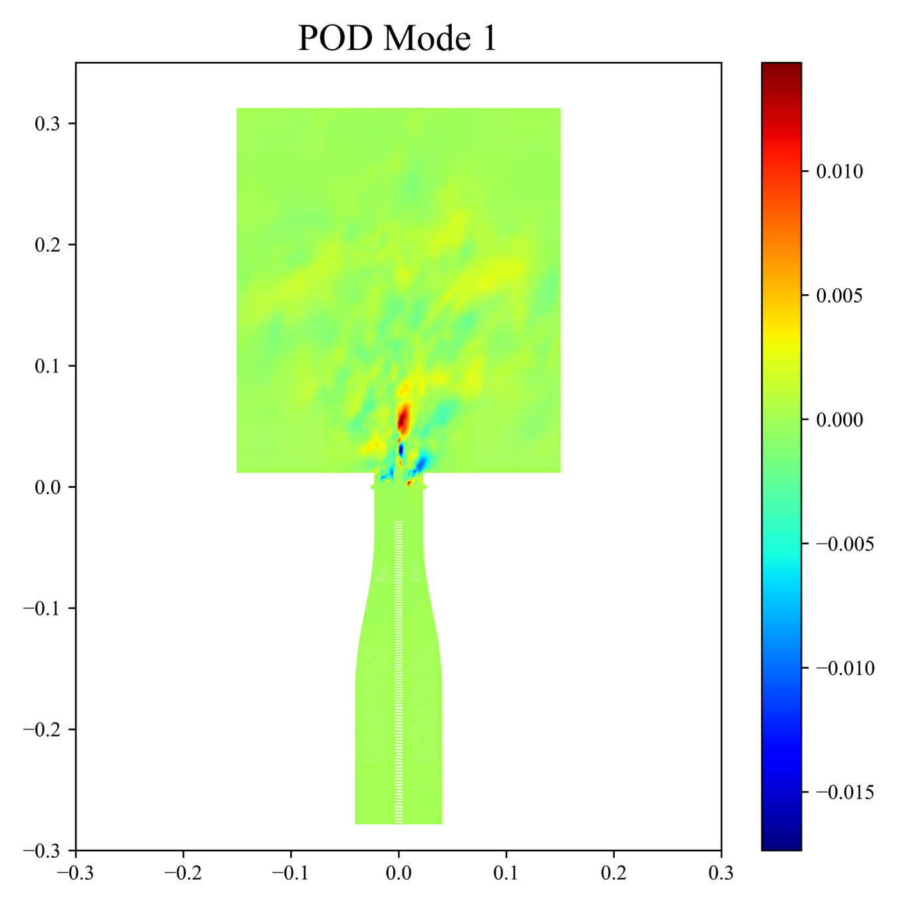
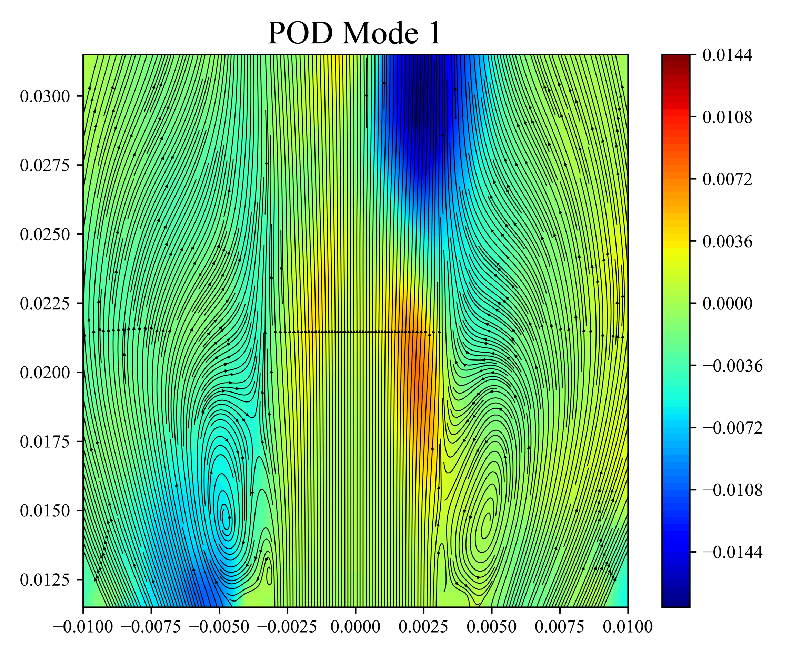
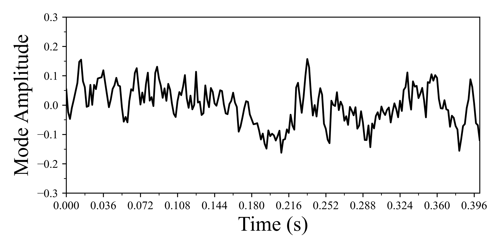
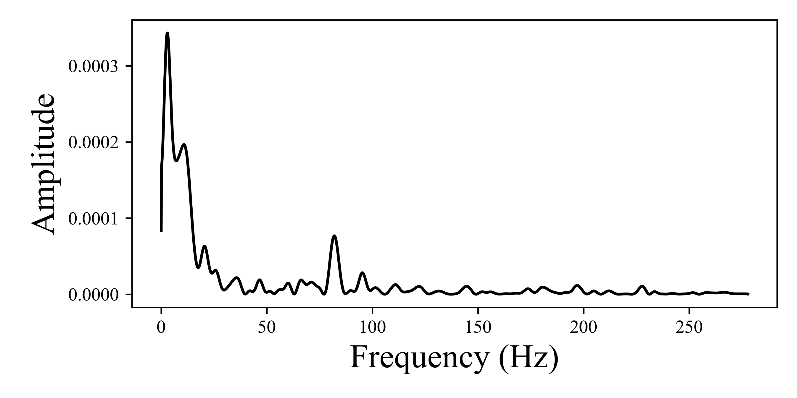
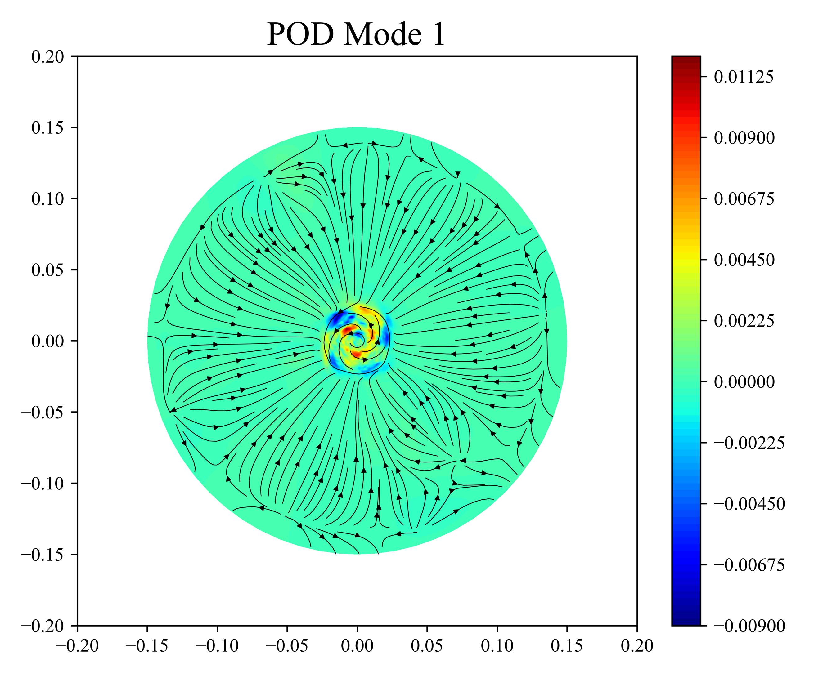
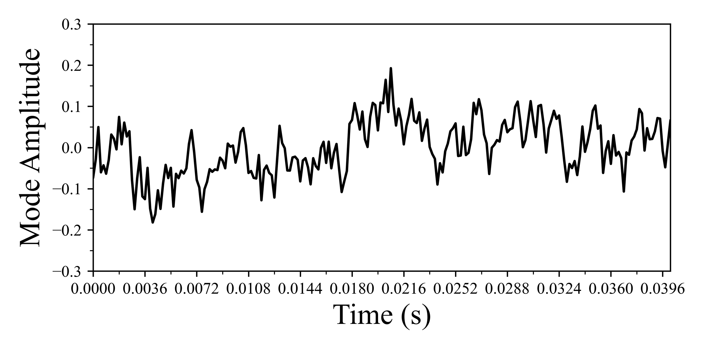
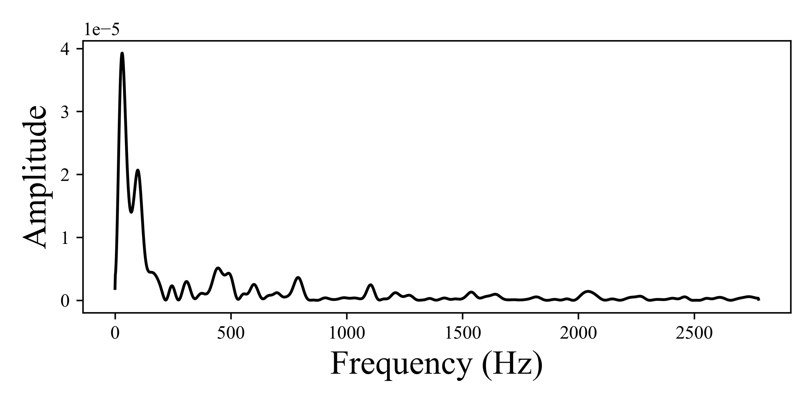

*Co-authors: Nhan Truong, Kamin Manu.*
*Status: ongoing.*

Swirling injectors show up in nearly every gas turbine and liquid rocket engine. The swirl sets up a recirculation zone that loops hot gas back to ignite incoming reactants. Lose that zone and the flame blows out, which makes it the heart of combustor stability. As the swirl gets stronger the zone changes shape, moving from a pre-vortex-breakdown state toward a central recirculation bubble, but how and why that transition happens still isn't settled.

The scope of this work is to identify the dominant frequencies of the flow. If any of those frequencies lands close to a natural acoustic mode of the combustor, it can couple with the flame and drive destructive pressure oscillations. Knowing where the strong frequencies sit, and what structures drive them, is the first step to designing around that risk. The setup follows Pattanshetti et al.'s experimental and numerical study of the same coaxial jet, so the structures have a reference to sit against.

  
  

*The LES domain. Side view (left) and sectioned view (right) showing the swirler geometry and the chamber downstream.*

The mean field locates where the bubble sits. The instantaneous field shows it breathing and shifting in place.

  

*Mean velocity field. The recirculation zone sits on the centerline downstream of the swirler, with the inner shear layer wrapping around it.*

  <video autoplay loop muted playsinline controls src="instantaneous_flow_field.mp4" style="width:100%;"></video>

*Instantaneous velocity magnitude showing the bubble's unsteady motion and the shear layers around it.*

I extracted the dominant unsteady structures with POD on two sampled regions, because the most energetic motions live in different parts of the flow. The first is a slice along the jet axis. The second is centered on the main recirculation region.

The slice dataset concentrates its energy right at the nozzle exit, where the shear is strongest. Alternating red and blue lobes show a pulsation along the jet axis as the swirling stream emerges. The temporal coefficient confirms the motion is sustained over the full simulation, and the FFT gives a clear dominant frequency.

  
  

  
  

*Spatial mode, temporal coefficient, and FFT for the slice dataset sampled along the jet axis.*

The dataset centered on the main recirculation region shows an off-axis spiral in the spatial mode. That structure is a precessing vortex core, the rotating motion characteristic of strongly swirling flows. The FFT shows a clear dominant peak here too.

  
  
  

*Spatial mode, temporal coefficient, and FFT for the dataset sampled at the center of the main recirculation region.*

This is where cold-flow POD becomes useful for combustor design. The dominant frequency tells designers which acoustic frequencies the chamber must avoid, with a safety margin. The spatial location tells them where the flame will be most disturbed once combustion is added, since the flame sits in this same region. Doing the analysis in cold flow gives the design team actionable numbers cheaply, before reacting simulations and long before any hardware is built.

The next step is adding combustion. The cold-flow frequencies identified here give a baseline, and a reacting LES will show whether they survive the heat release and how strongly they couple to the chamber's acoustic modes. After that comes comparison against experimental pressure measurements and any swirler geometry changes that come out of the design loop.
